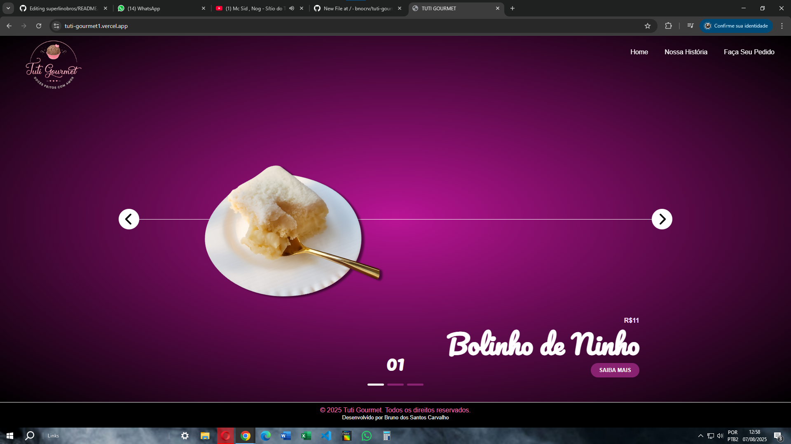

# Tuti Gourmet

Tuti Gourmet é um site de doceria criado para a empresa da minha irmã, desenvolvido com HTML, CSS e JavaScript. Este projeto foi um primeiro esboço feito após estudos rápidos no DevClub, com foco em responsividade mobile e aprimoramento do cardápio e sistema de pedidos.

[🔗 Acesse o site](https://tuti-gourmet1.vercel.app/)

---

---

# 🍰 Funcionalidades principais

- Site simples para uma doceria gourmet com cardápio interativo e carrossel visual dos produtos  
- Sistema básico de pedidos via WhatsApp, disponível na última página  
- Layout responsivo limitado: funciona bem no desktop, mas precisa de melhorias significativas para dispositivos móveis  
- Navegação simples e intuitiva, apesar de pontos a aprimorar no fluxo de pedidos  
- Estudo inicial para implementar melhorias futuras na usabilidade e funcionalidades

---

# 📷 Screenshot

---

# 📁 Estrutura do projeto

- 📁 img → Imagens e fotos dos produtos  
- 📄 faça-seu-pedido.html → Página para realizar pedidos via WhatsApp  
- 📄 index.html → Página inicial com carrossel de produtos  
- 📄 nossa-historia.html → Página sobre a história da doceria  
- 📄 scripts.js → Scripts de interação e funcionalidades  
- 📄 style.css → Estilos e layout do site  

---

# 🛠️ Tecnologias utilizadas

- HTML5 semântico  
- CSS3 para estilização e layout  
- JavaScript (vanilla) para funcionalidades básicas  

---

# 🚀 Próximos passos / Melhorias a fazer

- Ajustar e otimizar a responsividade para dispositivos móveis, garantindo boa usabilidade e visual  
- Reestruturar a forma de realizar pedidos, tornando o processo mais simples e direto, com mais opções além do WhatsApp  
- Aprimorar o carrossel de produtos para maior interatividade e performance  
- Adicionar funcionalidades dinâmicas ao cardápio para melhorar a experiência do usuário  
- Explorar integração com backend para salvar pedidos e gerenciar o cardápio de forma mais eficiente  

---

# 👨‍💻 Sobre

Esse projeto foi o primeiro insight que me motivou a começar a desenvolver projetos práticos e colocar a mão na massa, inspirado em estudos no DevClub e desejo de ajudar no negócio da minha irmã.

---

# 📫 Contato

- GitHub: [@bnocrv](https://github.com/bnocrv)  
- LinkedIn: [@bnocrv](https://linkedin.com/in/bnocrv)  
